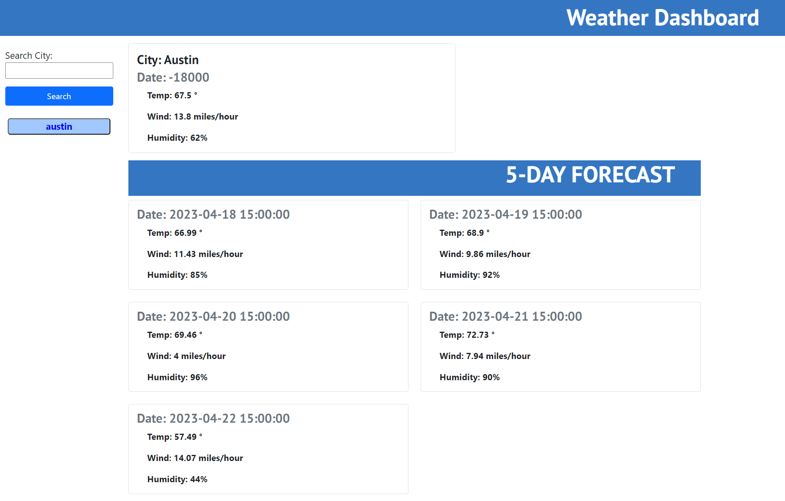
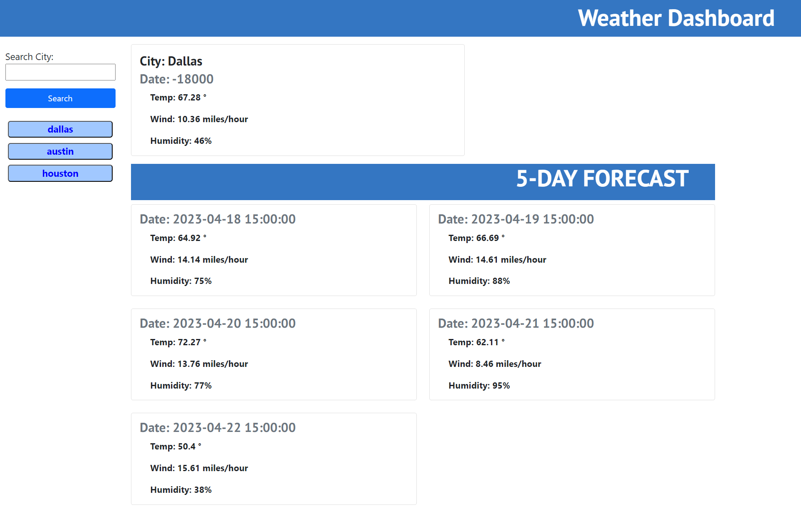

# Weather Forecast

## Description
Server-side APIs (Application Programming Interface) are applications used by developers to increase development speed helping integrating new software to existing apps facilitating the user a better experience in a shorter amount of time.

OpenWeather is one of many open source APIs who facilitate information to develop web applications. In this case we were asked to create a weather-forecast application.

URL: https://garfias06.github.io/weather-forecast/
GitHub: https://github.com/garfias06/weather-forecast

## Usage
When web page is displayed, the traveler (user) will be presented with a search section on the left side of the page so any city within the US can be found and weather will be shown to the traveler.

The weather information that this webpage displays to the user is the current weather of the day searched plus information about the weather in the next five days.

The information that is presented to the user is the following:
- City Name
- Date
- Main Temperature
- Humidity
- Wind Speed

## Credits
- https://openweathermap.org/
- https://www.w3schools.com/
- Tutor: Jose Lopez

## License
MIT License

Copyright (c) [2023] [Ulises-Garfias]

Permission is hereby granted, free of charge, to any person obtaining a copy
of this software and associated documentation files (the "Software"), to deal
in the Software without restriction, including without limitation the rights
to use, copy, modify, merge, publish, distribute, sublicense, and/or sell
copies of the Software, and to permit persons to whom the Software is
furnished to do so, subject to the following conditions:

The above copyright notice and this permission notice shall be included in all
copies or substantial portions of the Software.

THE SOFTWARE IS PROVIDED "AS IS", WITHOUT WARRANTY OF ANY KIND, EXPRESS OR
IMPLIED, INCLUDING BUT NOT LIMITED TO THE WARRANTIES OF MERCHANTABILITY,
FITNESS FOR A PARTICULAR PURPOSE AND NONINFRINGEMENT. IN NO EVENT SHALL THE
AUTHORS OR COPYRIGHT HOLDERS BE LIABLE FOR ANY CLAIM, DAMAGES OR OTHER
LIABILITY, WHETHER IN AN ACTION OF CONTRACT, TORT OR OTHERWISE, ARISING FROM,
OUT OF OR IN CONNECTION WITH THE SOFTWARE OR THE USE OR OTHER DEALINGS IN THE
SOFTWARE.